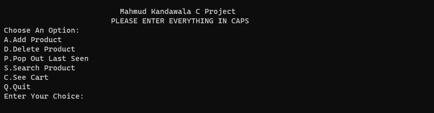
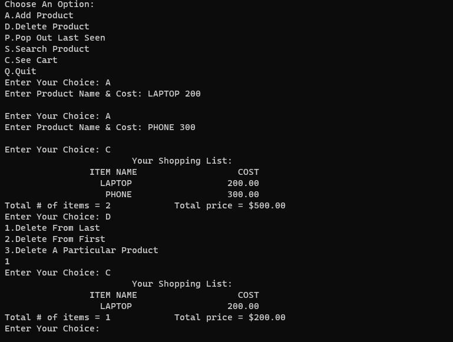

# C Shopping List Capstone Project

## Objective
Leveraged extensive knowledge of various data structures to create a comprehensive and efficient shopping cart program in C. This application seamlessly integrates multiple data structures to facilitate features such as adding and deleting items, tracking the last seen item, and querying specific products. My implementation showcases a profound grasp of these data structures and their practical application in designing a user-friendly and robust shopping cart system. This integration highlights my ability to effectively apply theoretical concepts to real-world programming challenges, thereby delivering a technically sound and highly functional solution.

## Images
 
 

## Data Structures Used
```
Linked List:
- A series of connected nodes where each node contains data and a reference to the next node.
- My code allows for dynamic addition and removal of items from the shopping cart.

Stack:
- A collection of elements with two principal operations: push (add an item) and pop (remove the last added item).
- It's useful in my program for features like undoing the last action or viewing the last added item ('last seen item').

Queue:
- Similar to a stack but operates on a First In, First Out (FIFO) principle.
- The shopping cart is used for processing items in the order they were added, such as in a checkout process.

Circular Linked List:
- A variation of a linked list where the last node points back to the first node, forming a circle.
- This is used in my shopping cart for continuously cycling through items, which is useful in certain browsing or display functionalities.

Tree (specifically Binary Search Tree in this case):
- A hierarchical structure with a root value and subtrees of children, with a constraint that all the children are sorted.
- The shopping cart enables efficient searching and sorting of products, enhancing the user's ability to find items quickly.
```

## Functions

```
Push Function:
● Adds a new item to the cart.
● Utilizes dynamic memory allocation for creating nodes in the linked list and tree.
● Inserts new items at the end of the doubly linked list, maintaining the stack order.
● Places the new item in the binary search tree based on alphabetical order, ensuring efficient search operations.

Display Function:
● Iterates over the doubly linked list.
● Prints each product's name and cost and calculates the total cost.

Qdelete Function:
● Implements queue-like behavior.
● Removes the first item from the doubly linked list.

Pop Function:
● Implements stack-like behavior.
● Removes the last item from the doubly linked list.

Search Function:
● Searches for a product in the binary search tree.
● Optionally deletes the product from both the tree and the linked list, depending on the provided action character ('s' for search, 'd' for delete).

Main Function:
● Provides a menu-driven interface for interacting with the shopping cart.
● Handles user input for various operations like adding, deleting, searching, and viewing products.
```

## How It Works 
```
● The program starts with an empty shopping cart.
● When a product is added via Push, it's placed in the doubly linked list (for cart management) and the binary search tree (for efficient searching).
● The Display function can be used to view the cart's contents.
● Products can be searched or deleted through the Search function.
● The Pop and Qdelete functions mimic stack and queue behaviors to remove products from the cart.
```
## Conclusion
The program demonstrates a complex use of data structures for practical application. It efficiently manages a shopping list by allowing users to add, search, and delete items while providing a user-friendly interface. Integrating different data structures like linked lists, trees, stacks, queues, etc., illustrates a well-thought-out approach to solving a common real-world problem.

## Testing
Run EXE File
